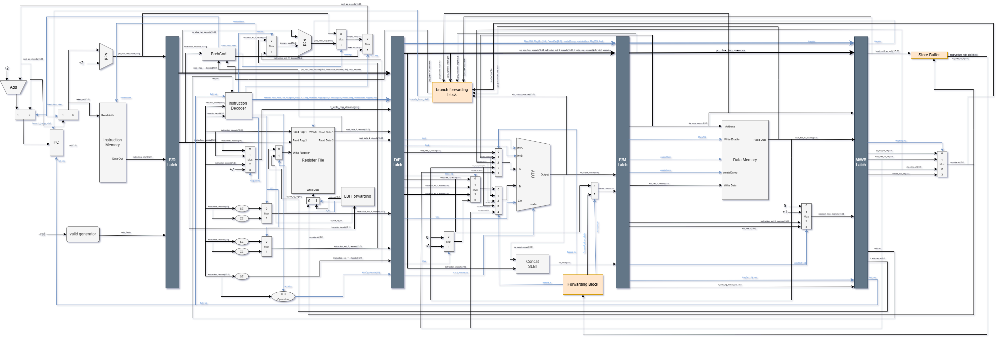

# Hi there, I'm [Harrison](https://github.com/hmrdo)   

I am a recent graduate from the University of Wisconsin-Madison, where I received a B.S.E in <b>Computer Engineering</b> & <b>Computer Sciences</b>. My passion for computing has driven me to explore the entire technology stack, from transistor-level circuits to UX design. I'm currently open to all opportunities involving development, programming, or engineering on any abstraction level. 

- 📚 **Relevant Coursework:**
  -  **Engineering:** Computer Architecture, Digital System Design & Synthesis, Microprocessor Systems, Semiconductor Devices & Integrated Circuits
  -  **Science:** Quantum Computer Architecture, Theory of Computing, User Interfaces, Operating Systems, Artificial Intelligence, Object-Oriented Programming
- 👷 **Professional Experience**
  - **Information Systems Engineering Internship** @ [PAR Systems](https://www.par.com/). Administrated Microsoft Azure products, used PowerShell for scripting interfaces for the company domain, as well as automating installation of OS and applications      
- Contact me at hmrdo@protonmail.com

 

  
  
  
  

 ***Skills*** 
-----
###### Languages:
                        

###### Frontend Deployment & Frameworks:
        

###### Backend Development
  

###### Deployment & Cloud:
      

###### Database Management:
  

###### Development Tools:
            

###### Development Environments:
        

###### Operating Systems / Platforms:
  

 ***Best Work*** 
-----

<b>FPGA-Based Object Detection & Targeting System</b>

  

  Given a constraint of using an FPGA, I and a group of four people created a motorized laser tracking system based on movement. 
  Our efforts earned us the Capstone Design Excellence Award, given by faculty and unique to our class.  
     
  
  

 

<b>5-Stage Pipelined Processor w/ Custom ISA</b>

  

  As part of a team of three, we designed and implemented a 5-stage pipelined processor with advanced architectural features, including branch prediction, data forwarding, and instruction & data caches. The project was developed in incremental stages over the semester, allowing us to build a strong foundation before integrating performance optimizations.
    
  

